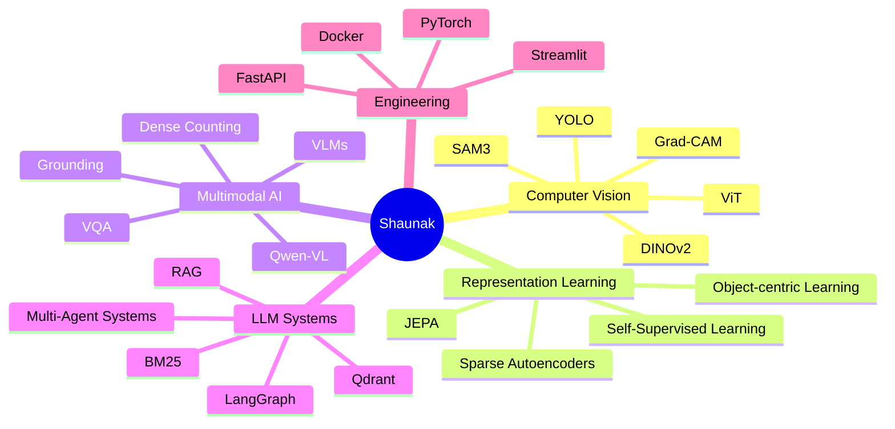
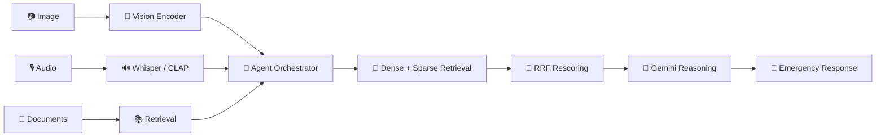
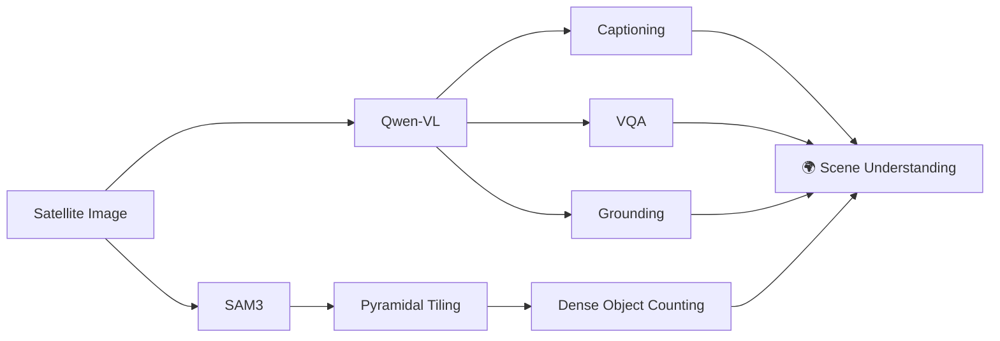
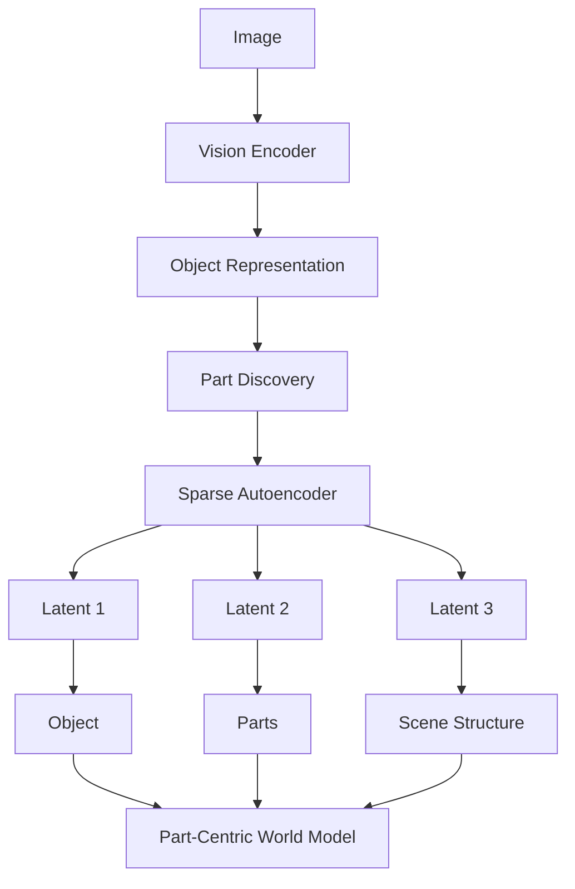
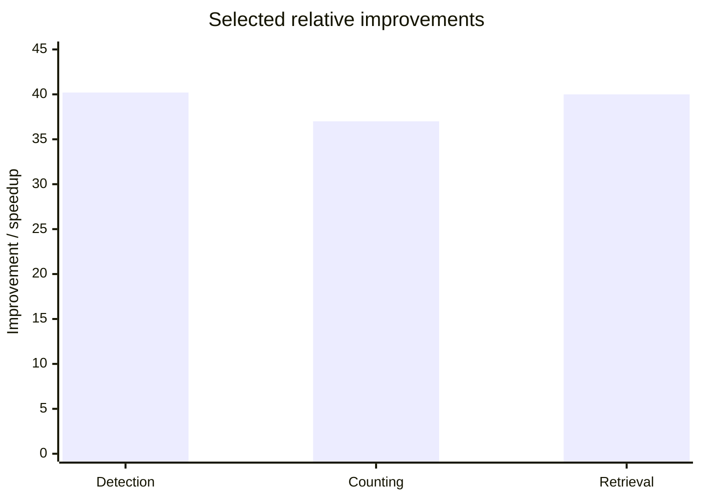
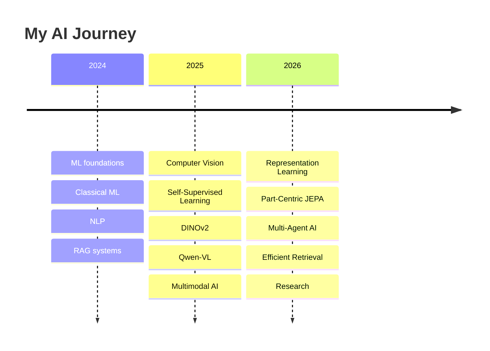

<div align="center">


<br>


<br>

<a href="https://github.com/23ME30056">

</a>

<a href="#">

</a>

<a href="#">

</a>

</div>

---

# 👋 Hey, I'm Shaunak.

> **I build AI systems and study the representations behind them.**

I'm an undergraduate researcher at **IIT Kharagpur**, working across **Computer Vision, Self-Supervised Learning, Multimodal AI, LLM systems and representation learning**.

My current obsession:

```text
                    HOW DO MACHINES REPRESENT THE WORLD?
                                  │
             ┌────────────────────┼────────────────────┐
             ▼                    ▼                    ▼
       OBJECTS & PARTS       VISION + LANGUAGE       AI SYSTEMS
             │                    │                    │
           JEPA                  VLMs                 RAG
           SAEs                Qwen-VL              Agents
            SSL                 SAM3                Retrieval
           DINOv2               VQA                  APIs
```

---

# 🧬 Research Universe



---

# 🔬 What I'm Working On

<div align="center">

<table>
<tr>
<td width="50%" align="center">

## 🧩 PART-CENTRIC JEPA

**Object → Part → Scene**

Exploring encoder-agnostic world models with **sparse autoencoders and disentangled latent representations**.

`JEPA` `SAE` `ViT` `Representation Learning`

</td>

<td width="50%" align="center">

## 🛰️ DRISHTI

**See → Ground → Reason**

A unified VLM framework for satellite imagery.

`Qwen-VL` `QLoRA` `DPO` `SAM3`

</td>
</tr>

<tr>
<td width="50%" align="center">

## 🛡️ PROJECT RAKSHAK

**Sense → Retrieve → Reason → Respond**

A 15-agent multimodal disaster-response system.

`Gemini` `DINOv2` `Qdrant` `BM25` `Whisper` `CLAP`

</td>

<td width="50%" align="center">

## 🔍 CRACK DETECTION

**Learn with less supervision**

CrANet + CBAM + SSL + DINOv2 for label-efficient crack detection.

`PyTorch` `SSL` `DINOv2` `Grad-CAM`

</td>
</tr>
</table>

</div>

---

# 📸 Research Gallery

<div align="center">

<!-- Replace these with actual project screenshots stored in /assets -->


<br><br>


</div>

<br>

<sub>
↑ Visual research artifacts: model architectures, qualitative results, attention maps, Grad-CAM visualizations and system diagrams.
</sub>

---

# 🧠 How My Systems Think

### Multimodal Disaster Response



---

# 🛰️ Multimodal Vision



---

# 🧩 Representation Learning



---

# 📈 Numbers I Care About

<div align="center">

<table>
<tr>

<td align="center">
<h2>40.2%</h2>
<b>Detection Gain</b>
<br>
<sub>with only 5% labelled data</sub>
</td>

<td align="center">
<h2>99.7%</h2>
<b>Classification</b>
<br>
<sub>DINOv2 · 30ms inference</sub>
</td>

<td align="center">
<h2>37%</h2>
<b>Counting Improvement</b>
<br>
<sub>Adaptive Grounding</sub>
</td>

<td align="center">
<h2>40×</h2>
<b>Retrieval Speedup</b>
<br>
<sub>Qdrant Binary Quantization</sub>
</td>

</tr>
</table>

</div>

---

# 📊 Research Impact



<sub>
Detection and counting are percentage improvements; retrieval is a reported speedup factor. The chart is intended as a visual snapshot rather than a directly comparable scientific benchmark.
</sub>

---

# 🏗️ My AI Stack

<div align="center">


<br><br>


</div>

<br>

<div align="center">

`PyTorch` · `Hugging Face` · `Qwen-VL` · `Gemini` · `DINOv2` · `YOLO` · `SAM3`

`Qdrant` · `FAISS` · `ChromaDB` · `BM25` · `LangGraph` · `FastAPI` · `Docker`

</div>

---

# 🏆 Selected Achievements

<div align="center">

| 🏆 Achievement                     |         Result         |
| :--------------------------------- | :--------------------: |
| Goldman Sachs India Hackathon 2026 |  **National Finalist** |
| Inter IIT Tech Meet 14.0 × ISRO    |       **🥇 Gold**      |
| Hack The Future 2025               |   **🥉 National 3rd**  |
| Kharagpur Data Science Hackathon   |  **Top 10 / 10,000+**  |
| EMPOWER Student Design Challenge   | **🥇 National Winner** |

</div>

---

# 📊 GitHub Analytics

<div align="center">


<br><br>


</div>

---

# 🗺️ The Road So Far



---

# 🔭 Currently Exploring

<div align="center">

`OBJECT-CENTRIC LEARNING`

↓

`PART-LEVEL REPRESENTATIONS`

↓

`WORLD MODELS`

↓

`MULTIMODAL REASONING`

↓

`AGENTIC AI`

</div>

---

# 📚 Research Philosophy

<div align="center">

> **Don't just make the model work.**
>
> **Understand what it learned.**
>
> **Measure why it works.**
>
> **Then make it better.**

</div>

---

# 📫 Let's Connect

<div align="center">

<a href="https://github.com/23ME30056">

</a>

<a href="YOUR_LINKEDIN_URL">

</a>

<a href="mailto:YOUR_EMAIL">

</a>

</div>

<br>

<div align="center">


### `Research deeply. Build relentlessly. Measure everything.`

</div>


<!---
23ME30056/23ME30056 is a ✨ special ✨ repository because its `README.md` (this file) appears on your GitHub profile.
You can click the Preview link to take a look at your changes.
--->
