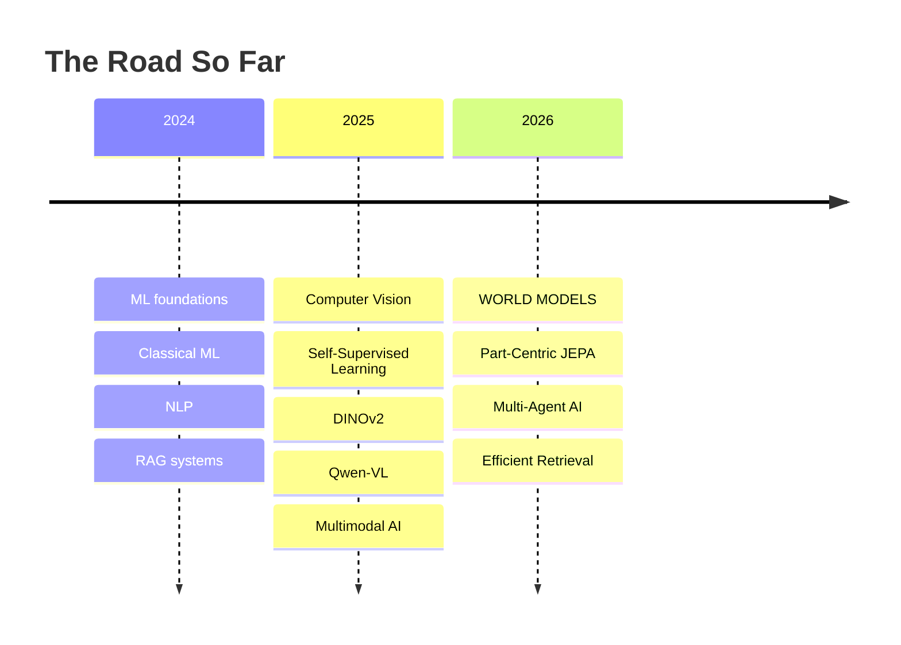

<!-- ═══════════════════════════════════════════════════════════════════════════
     SHAUNAK MAJUMDAR · github.com/23ME30056
     ═══════════════════════════════════════════════════════════════════════════ -->

<div align="center">


<a href="https://github.com/23ME30056">
  
</a>

<br/>


<a href="https://github.com/23ME30056?tab=followers"></a>
<a href="https://github.com/23ME30056?tab=repositories"></a>


<br/><br/>

<!-- ─────────────  LIVE CONTRIBUTION SNAKE  ─────────────
     Requires the workflow in .github/workflows/snake.yml (included in this repo).
     It eats your contribution graph every 12 hours. -->
<picture>
  <source media="(prefers-color-scheme: dark)" srcset="https://raw.githubusercontent.com/23ME30056/23ME30056/output/snake-dark.svg" />
  <source media="(prefers-color-scheme: light)" srcset="https://raw.githubusercontent.com/23ME30056/23ME30056/output/snake.svg" />
  
</picture>

</div>

---

<div align="center">

## `> whoami`

</div>

```python
class Shaunak:
    def __init__(self):
        self.role      = "Undergraduate Researcher, Complex Networks Group"
        self.institute = "IIT Kharagpur · B.Tech + M.Tech (Mech) · CSE minor · AI micro-spec"
        self.focus     = ["world models", "vision-language models",
                          "self-supervised learning", "agentic AI systems"]
        self.question  = "How do machines represent the world?"

    def philosophy(self):
        return "Don't just make the model work. Understand what it learned."
```

<div align="center">

```
             HOW DO MACHINES REPRESENT THE WORLD?
                           │
      ┌────────────────────┼────────────────────┐
      ▼                    ▼                    ▼
OBJECTS & PARTS       VISION + LANGUAGE       AI SYSTEMS
      │                    │                    │
    JEPA                  VLMs                 RAG
    SAEs                Qwen-VL              Agents
     SSL                 SAM3                Retrieval
    DINOv2               VQA                  APIs
```

</div>

---

<!-- ═══════════════════════════════════════════════════════════════════════════
     THE OBSERVER — generated, not traced.
       python tools/make_observer.py
       python tools/digit_face.py observer.png --no-crop --width 108
     Swap in your own photo any time:
       python tools/digit_face.py me.jpg --width 92 --gamma 1.15
     ═══════════════════════════════════════════════════════════════════════════ -->

<div align="center">

## `> ./render --mode=digits`


**`THE OBSERVER`**

<sub>an eye, decoded from luminance into base-10 · every glyph chosen by ink density<br/>
procedurally generated from math, then dissolved through a digit lattice</sub>

</div>

---

<div align="center">

## `> cat research/current.log`

</div>

<table>
<tr>
<td width="50%" valign="top">

### 🧩 PART-CENTRIC JEPA
**`Object → Part → Scene`**

Encoder-agnostic world models with sparse autoencoders and disentangled latents. Chasing part-level structure that emerges without labels.

`JEPA` `SAE` `ViT` `WORLD MODELS`

</td>
<td width="50%" valign="top">

### 🛰️ DRISHTI
**`See → Ground → Reason`**

A unified VLM framework for satellite imagery. Captioning, VQA, grounding and dense counting in one stack.

`Qwen-VL` `QLoRA` `DPO` `SAM3`

</td>
</tr>
<tr>
<td width="50%" valign="top">

### 🛡️ PROJECT RAKSHAK
**`Sense → Retrieve → Reason → Respond`**

15-agent multimodal disaster-response system. Binary-quantized vector search over image, audio and text under latency pressure.

`Gemini` `DINOv2` `Qdrant` `BM25` `Whisper` `CLAP`

</td>
<td width="50%" valign="top">

### 🔍 CRACK DETECTION
**`Learn with less supervision`**

CrANet + CBAM + SSL + DINOv2 for label-efficient structural crack detection with attention-map validation.

`PyTorch` `SSL` `DINOv2` `Grad-CAM`

</td>
</tr>
</table>

---

<div align="center">

## `> stats --numbers-i-actually-defend`

<table>
<tr>
<td align="center" width="25%">
<h1>40.2%</h1>
<b>Detection Gain</b><br/>
<sub>vs. supervised baseline · 5% labels</sub>
</td>
<td align="center" width="25%">
<h1>99.7%</h1>
<b>Classification</b><br/>
<sub>DINOv2 · 30 ms inference</sub>
</td>
<td align="center" width="25%">
<h1>37%</h1>
<b>Counting Gain</b><br/>
<sub>adaptive grounding vs. tiling</sub>
</td>
<td align="center" width="25%">
<h1>40×</h1>
<b>Retrieval Speedup</b><br/>
<sub>Qdrant binary quantization</sub>
</td>
</tr>
</table>

</div>

---

<div align="center">

## `> uname -a  # the stack`


<br/>


<br/><br/>


</div>

---

<!-- ═══════════════════════════════════════════════════════════════════════════
     GITHUB ANALYTICS — the whole telemetry suite
     ═══════════════════════════════════════════════════════════════════════════ -->

<div align="center">

# 📊 `> git log --author="Shaunak" --stat`


### ⚡ Core Telemetry


<br/>

### 🔥 Commit Volume, Push Cadence & Language Split


<br/>


<br/>


<br/>

### 📈 Contribution Activity — Commits · PRs · Issues over time


<br/>

### 🧊 3D Contribution Skyline

<!-- Requires the workflow in .github/workflows/3d-contrib.yml (included) -->


<br/>

### 🏆 Trophy Cabinet


<br/>

### 🧑‍💻 Where My Commits Land


</div>

---

<div align="center">

## 🏅 `> cat achievements.tsv`

</div>

| Competition | Scale | Result |
| :--- | :--- | :--- |
| **Inter IIT Tech Meet 14.0 × ISRO** | All IITs | 🥇 **Gold Medal** |
| **EMPOWER Student Design Challenge** | National | 🥇 **National Winner** |
| **Goldman Sachs India Hackathon 2026** | National | 🎖️ **National Finalist** |
| **Hack The Future 2025** | National | 🥉 **National 3rd** |
| **Kharagpur Data Science Hackathon** | 10,000+ entrants | 🔟 **Top 10** |

---

<div align="center">

## 🗺️ `> git log --oneline --reverse`

</div>



<div align="center">

`OBJECT-CENTRIC LEARNING` **→** `PART-LEVEL REPRESENTATIONS` **→** `WORLD MODELS` **→** `MULTIMODAL REASONING` **→** `AGENTIC AI`

</div>

---

<div align="center">

## 📸 Research Gallery


<br/>


<sub>architectures · qualitative results · attention maps · Grad-CAM</sub>

</div>

---

<div align="center">

> ### **Don't just make the model work.**
> ### **Understand what it learned. Measure why it works. Then make it better.**

<br/>

## 📫 `> ping shaunak`

<a href="https://www.linkedin.com/in/shaunak-majumdar-865a27285/"></a>
<a href="mailto:shaunak17@kgpian.iitkgp.ac.in"></a>
<a href="mailto:nanoheist007@gmail.com"></a>
<a href="https://github.com/23ME30056"></a>

<br/><br/>


</div>
